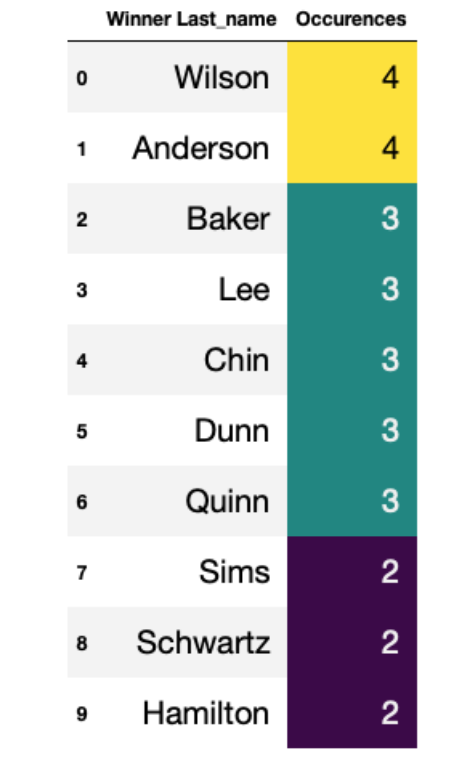

# Project_4_Jeopardy

# Group

[Elisangela](https://github.com/ElisJardim)
[Geetha]()
[Kurt](https://github.com/KurtGoesch)
[Justin](https://github.com/DeMaagdJ)

# About Jeopardy

* American television game show created by Merv Griffin
* Original version debuted in March 1964 and ran until Jan 1975
* Current version premiered in Sept 1984
Has won a record 39 Daytime Emmy awards

# Jeopardy! Analysis based on gender

* Data from 11th Feb 2014 to 26th July 2019, courtesy kdnuggets.com
* Total number of contestants = 1827
* 901 individual men and 926 individual women participated.

* Men won 690 times.
* Women won 469 times.

* Number of games women participated in vs men each year from 2014 to 2019

* Total number of winners

* Men vs Women winners

* 10 Highest Scores

* 10 Lowest Scores

* Most common winner last names

* Most common winner first names

## Machine Learning Optimization model (Gender)

### Overview

The purpose of this analysis is to create a binary classification model using deep learning techniques to determine what factors contributed to winning the Jeopardy! Game. The data used was from kdnuggets.com and was limited to only a few years(from 2014 to 2019)

The feature variables used were the contestants’ 
* Full names, 
* First Name, 
* Last Name, 
* their occupation
* city they were from
* state they were from
* Show number
* Date they were on the show
* Winner_flg (‘1’ if they won)
* Final_score for that game
* Gender

## The pre-processing

The data was read and converted to numerical data using get_dummies. This numerical data was then run through a RandomForestClassifier to find which features were of most importance. It was found that while final_score was the biggest determinant of whether a contestant was going to win, their gender or where they were from did not play a significant part.

## Training and evaluating the model

The first task was to drop the insignificant features (including Gender) from the data. Next, the data was run through a keras tuner to find the best optimization for training. 

Epochs chosen was 100, to produce an accuracy of 99.72% and a loss of 31.7%

## Conclusion 

 According to this small dataset, Jeopardy! is a fair game where the outcome is entirely dependent on the accuracy of the contestant’s answer and has nothing to do with their gender, where they were from or when they participated in the game.

 # Jeopardy! Common Words 

 ## Introduction

 * Datasets in Jeopardy take into consideration several classes including: Contestants, Show number, Date of air, score, Questions, Categories, Answers, and much more.
 * The Questions, Categories, and Answer sets are highly robust, containing a vast amount of information that can be analyzed and interpreted through Natural Language Processing.
    * Word Frequency
    * Sentiment Analysis
    * Term Frequency–Inverse Document Frequency (TF-IDF)

## Objective

* The task was to build a database for querying relevant data to explore.  
* Query the dataset to provide relational datasets that can be further analyzed in NLP processes
* Utilize new technologies including “Natural Language Toolkit” (NLTK) and TF-IDF.
* Program to train a classification model on the language sentiment found in datasets
* Program to train a classification model on how important the common words that were found when other features are applied to the machine learning
* In the case of this project the independent feature was on highly frequent categories

## Word Clouds – Most Common Words

* Why do we have two different outputs from different modules?
* The Word Cloud generated cloud did not go through the same preprocessing such a lemmatization. 
* The NLTK module, words were tokenized into unigrams, adding more granularity to the word count frequency

* Word Cloud from WordCloud Module for Answers

*  Word Cloud from NLTK Module for Answers

* Word Cloud from WordCloud Module for Categories

* Word Cloud from NLTK Module for Categories

## Sentiment Analysis Using a Random Forest Classifier

## Discussion

The objective was to determine the best features of our dataset to classify the most common words found in our Jeopardy dataset
* This was in effort to enlighten our audience to think about ways a contestant would be able to focus their preparation on the show
    * Word frequencies and the word clouds offer a basis for someone studying to have a fundamental starting point for their study efforts
 
* The TF-IDF values proved to be challenging because the imbalance of our independent data prevented for an accurate score in the classification report
    * Issues possibly include overfitting the data, and analyzing classification ratings with relatively low counts  against classifications with much higher counts

* The sentiment analysis was processed and trained with much more accuracy.
    * This may have been impacted by utilizing a smaller view of the data
    * The sentiment analysis does not bring much relevant insight  to our audience as it is meant to describe the emotional context of the words.  Since Jeopardy is a game of facts, a basis of emotion has little bearing for a potential contestant

# Jeopardy! Analysis based on occupation

We can see a wide range of occupation represented in our sample of Jeopardy contestants. 
Within our range of contestants, there are approximately 1,317 distincts careers held by individual contestants. 
But is it possible to predict who will win based on just a contestant's occupation? 
This is the challenge question that I would like to answer. 

## Features

Occupation
City
State
Date of show
Winner_flg (‘1’ if they won)
Final_score for that game

## Preprocessing

The data was read and converted to numerical data using get_dummies. I have choose to keep all initial features. I also have choose drop the "winner_flg"in X

## Training the model

## References

* [Keras - Plot training, validation and test set accuracy](https://stackoverflow.com/questions/41908379/keras-plot-training-validation-and-test-set-accuracy)

* [kdnuggets.com](https://www.kdnuggets.com/)

* https://j-archive.com/

